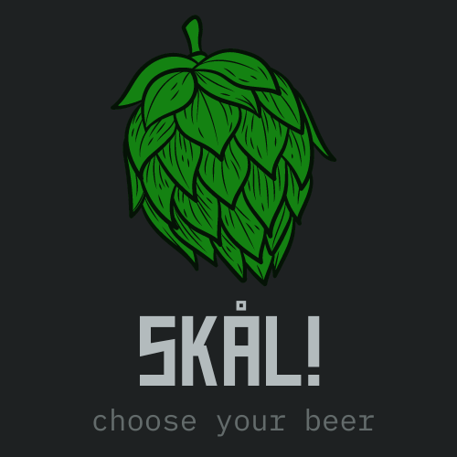

<div align="center">
  
  <hr>
</div>

<p align="center">
  
  
  
  <br />
  
</p>

## Description

**Skal** is a simple example of a craft beer e-commerce. The purpose of this project is learn and practice good programming practices
and software architecture patterns.

## Technologies

The project was developed using the following technologies
- [NodeJS](https://nodejs.org/en/)
- [Typescript](https://www.typescriptlang.org/)
- [Jest](https://jestjs.io/)
- [GitHub Actions](https://docs.github.com/en/actions)

## Functional requirements

:heavy_check_mark: Should not create an order with an invalid CPF

:heavy_check_mark: Should create a order with 3 items (with description, price and quatity)

:heavy_check_mark: Should create an order with a discount coupon (percentage on the order total)

:heavy_check_mark: Should not apply a expired discount coupon

:heavy_check_mark: When placing an order, the quantity of an item cannot be negative

:heavy_check_mark: When placing an order, the same item cannot be entered more than once

:heavy_check_mark: No item dimension can be negative

:heavy_check_mark: Item weight cannot be negative

:heavy_check_mark: Should return the minimum freight price if it is higher than the calculated value

:heavy_check_mark: Calculates the freight based on the dimensions (height, width and depth in cm) and the weight of the products (in kg)

## Requirements for use

  To be able to run the project on your machine you will need to have installed **[Node.js](https://nodejs.org/en/)** version **v18.12.1**.

## Running the project

  To run the project it is recommended to use yarn
  ```bash
  $ npm install --global yarn
  ```
  ```bash
  # Clone the repository
  $ git clone <https://github.com/CleitonAmbrosini/e-commerce-example>
  # Go to project page
  $ cd e-commerce-example
  # Install the dependencies
  $ yarn
  # Run the tests
  $ yarn test
  ```

## Commit types

-   **build**: Changes that affect the build system or external dependencies (example scopes: gulp, broccoli, npm)
-   **ci**: Changes to our CI configuration files and scripts (example scopes: Travis, Circle, BrowserStack, SauceLabs)
-   **docs**: Documentation only changes
-   **feat**: A new feature
-   **fix**: A bug fix
-   **perf**: A code change that improves performance
-   **refactor**: A code change that neither fixes a bug nor adds a feature
-   **style**: Changes that do not affect the meaning of the code (white-space, formatting, missing semi-colons, etc)
-   **test**: Adding missing tests or correcting existing tests
-  **lib**: Adding a new lib

##  Author


##### Cleiton A. Ambrosini
###### _Software Developer_

[](mailto:cleiton.ambro@gmail.com)
[](https://www.linkedin.com/in/cleitonambrosini/)